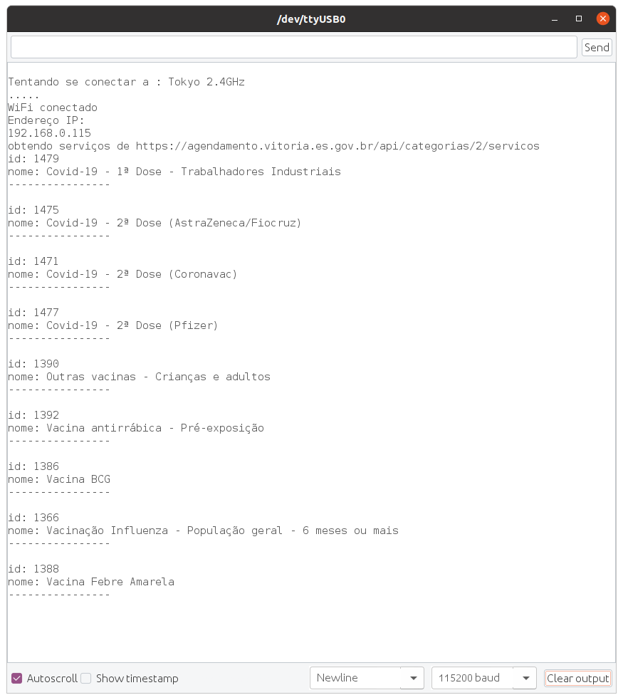

# Internet
O objetivo desse trabalho é desenvolver um código capaz de fazer o ESP32 se comunicar com um dispositivo na Internet.

## Resumo
O código [internet.ino](internet.ino) se conecta na wifi através das credenciais, realiza um GET na API da prefeitura de vitória, na qual responde um JSON, contendo as informações das vacinações e imprime cada um do serviços.

```bash
curl -i -H "Accept: application/json" https://agendamento.vitoria.es.gov.br/api/categorias/2/servicos

```
resposta: 
```json
  [
   {
    "id": 1475,
    "nome": "Covid-19 - 2ª Dose (AstraZeneca/Fiocruz)",
    "descricao": "Atenção !!!!\r\nAgendamento EXCLUSIVO para pessoas  que tomaram a 1ª Dose da Vacina AstraZeneca  até o dia 03 de junho.\r\nDocumentação exigida: Comprovante da 1ª Dose e documento com foto"
   },
  ]
```

## Resultado
A comprovação da execução do código pode ser visualizada abaixo:



## Dependencias
- HTTPClient
- Wifi do Esp32
- ArduinoJson