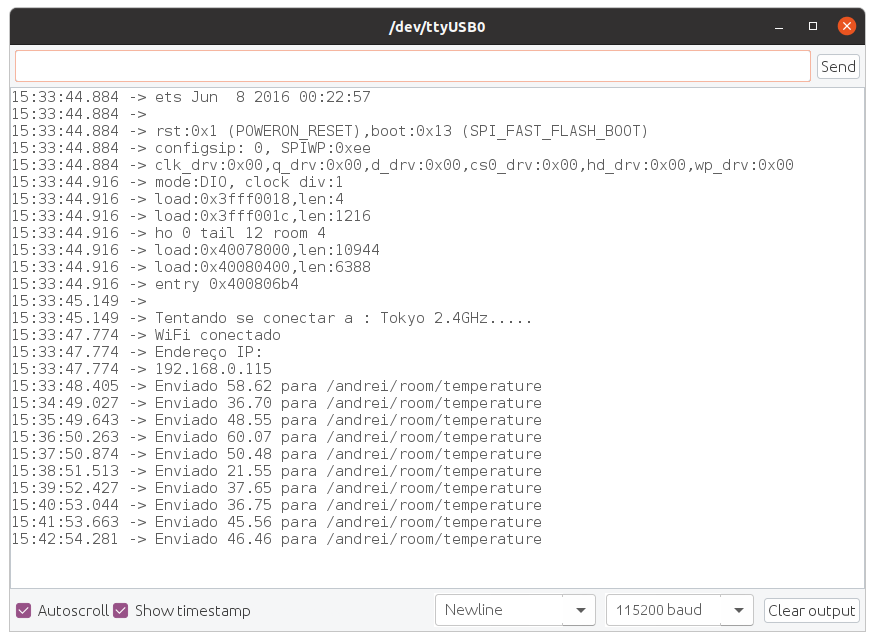
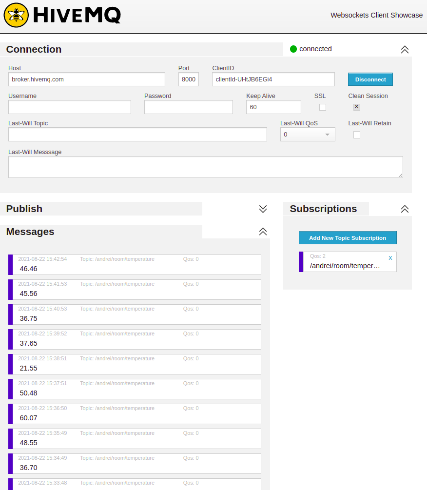

# Internet
O objetivo desse trabalho é desenvolver um código capaz de fazer o ESP32 enviar uma variável do ambiente (simulada), através do protocolo mqtt, para o servidor Broker MQTT público [HiveMQ](https://www.hivemq.com/mqtt-cloud-broker/)

## Resumo
O código [mqtt.ino](mqtt.ino) se conecta na wifi através das credenciais, em seguida, conecta no servidor público através do endereço `mqtt://broker.hivemq.com:1883` e envia um valor de temperatura, a cada 1 minuto. 
Os valores de temperatura simulados são entre 16°C e 80°C.

## Dependencias
- Wifi do Esp32
- [PubSubClient](https://github.com/knolleary/pubsubclient)

## Resultado
O resultado do código pode ser observado através do print da serial do esp32 e pela dashboard web disponivel em [demo](http://www.hivemq.com/demos/websocket-client/)

Serial

Dashboard

A porta para se conectar via dashboard é `8000`, como é informado em http://www.mqtt-dashboard.com/, pois aqui é usado o protocolo WebSocket para ouvir os eventos via o navegador. 
